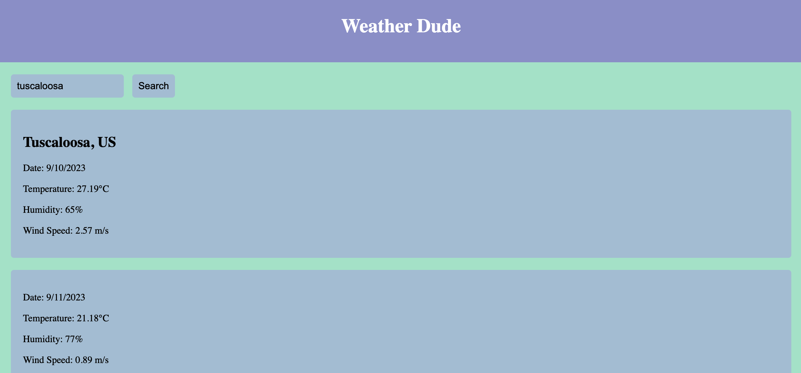

# Weather-Dude



## Description

The Weather Dude App is a simple web application that allows users to check the current weather and 5-day forecast for a specific city. Users can search for a city, view the current weather conditions, see a 5-day forecast, and access their search history.

## Features

- Display current weather information, including city name, date, temperature, humidity, and wind speed.
- Provide a 5-day forecast with details for each day.
- Store and display search history for quick access to previous searches.
- User-friendly interface with a responsive design.

## Usage

1. Enter the name of a city in the search input field.
2. Click the "Search" button.
3. The current weather for the city will be displayed in the left sidebar.
4. The 5-day forecast will be displayed in the center of the app.
5. Click on a city in the search history on the right sidebar to view its weather details again.

## Installation

1. Clone the repository:

   ```bash
   git clone https://github.com/andyalvarez11/Weather-Dude.git

2. Open the project folder in your code editor.

3. Configure the OpenWeather API:
    Get an API key from OpenWeather and replace 'YOUR_API_KEY' in the script.js file with your API key.
    Open index.html in your web browser to use the app.

## Technologies Used

HTML5
CSS3
JavaScript
OpenWeather API

## Acknowledgments
Thanks to OpenWeather for providing the weather data API.

## Author
Andy Alvarez
alvarezandy11@yahoo.com
https://github.com/andyalvarez11